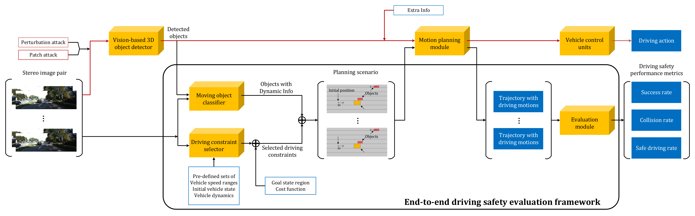

## Eval Driving Safety

## Evaluating Adversarial Attacks on Driving Safety in Vision-Based Autonomous Vehicles

This is an official implementation of our paper.

### Overview
Although driving safety is the ultimate concern for autonomous driving, there is no comprehensive study on the linkage between the performance of deep learning models and the driving safety of autonomous vehicles under adversarial attacks. 
In this paper, we investigate the impact of two primary types of adversarial attacks, namely, perturbation attacks and patch attacks, on the driving safety of vision-based autonomous vehicles rather than only from the perspective of the detection precision of deep learning models. 
In particular, we focus on the most important task for vision-based autonomous driving, i.e., the vision-based 3D object detection, and target two leading models in this domain, Stereo R-CNN and DSGN. 
To evaluate driving safety, we propose an end-to-end evaluation framework with a set of driving safety performance metrics.

### Adversarial attacks

- **DSGN**: please follow [attack/DSGN/README.md](attack/DSGN/README.md) to perform adversarial attacks.
- **Stereo R-CNN**: please follow [attack/Stereo-RCNN/README.md](attack/Stereo-RCNN/README.md)

### End-to-end driving safety evaluation framework
- Please follow [evaluation/README.md](./evaluation/README.md) to launch the driving safety evaluation framework.

### Acknowledgements
- We thank several repos for their contributions which are used in this repo
    - DSGN implementation is taken from [Jia-Research-Lab](https://github.com/Jia-Research-Lab/DSGN).
    - Stereo R-CNN implementation is taken from [HKUST-Aerial-Robotics Stereo-RCNN](https://github.com/HKUST-Aerial-Robotics/Stereo-RCNN).
    - We use the code for CommonRoad-Search with ([commit 0d434310](https://gitlab.lrz.de/tum-cps/commonroad-search/-/tree/0d434310f393e5af6c155507e691982ab8fd27890)) instead of the latest one.
  
### Contact
If you have any questions or suggestions about this repo, please feel free to contact me (kyrie.louy@gmail.com).